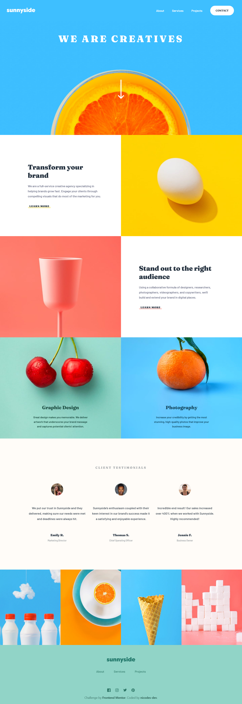

# Frontend Mentor - Sunnyside agency landing page solution

This is a solution to the [Sunnyside agency landing page challenge on Frontend Mentor](https://www.frontendmentor.io/challenges/sunnyside-agency-landing-page-7yVs3B6ef). Frontend Mentor challenges help you improve your coding skills by building realistic projects.

## Table of contents

- [Frontend Mentor - Sunnyside agency landing page solution](#frontend-mentor---sunnyside-agency-landing-page-solution)
  - [Table of contents](#table-of-contents)
  - [Overview](#overview)
    - [The challenge](#the-challenge)
    - [Screenshot](#screenshot)
    - [Links](#links)
  - [My process](#my-process)
    - [Built with](#built-with)
    - [Useful resources](#useful-resources)
  - [Author](#author)

**Note: Delete this note and update the table of contents based on what sections you keep.**

## Overview

### The challenge

Users should be able to:

- View the optimal layout for the site depending on their device's screen size
- See hover states for all interactive elements on the page

### Screenshot

### Links

- Solution URL: [repo](https://github.com/nicodes-dev/fem-sunnyside-agency-landing-page)
- Live Site URL: [live](https://sunnyside-agency-landing-page-challenge.onrender.com/)

## My process

### Built with

- Semantic HTML5 markup
- Flexbox
- CSS Grid
- Mobile-first workflow
- [Tailwindcss](https://tailwindcss.com/) - CSS framework

### Useful resources

- [Change color of SVG images from  tag](https://dirask.com/posts/CSS-change-color-of-SVG-images-from-img-tag-D9aJmD) - A nice solution for changing svg colors using img tag.
- [How to make a triangle shape](https://www.youtube.com/watch?v=tTNxykEAPpA&ab_channel=CodingArtist) - Short and easy way to make a triangle shape using in css.

## Author

- Frontend Mentor - [@nicodes-dev](https://www.frontendmentor.io/profile/nicodes-dev)
- Twitter - [@nicodesdev](https://twitter.com/nicodesdev)
